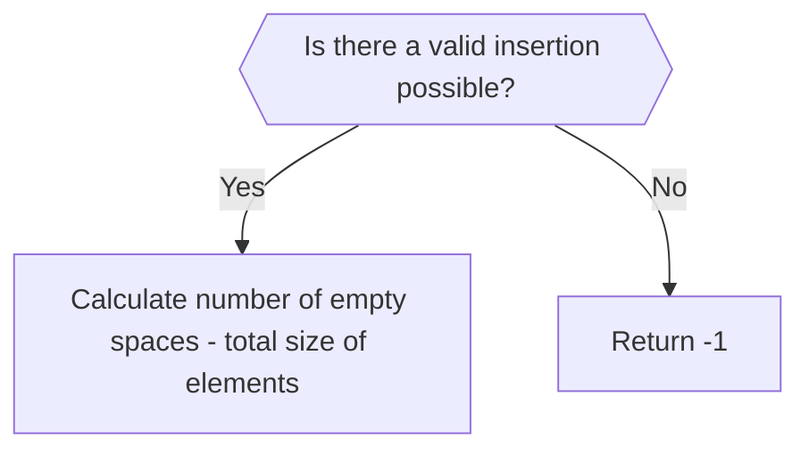

## Too Much Storage

Sid wants to download all the photos of the previous GDSC session to his computer, but is unsure whether he has enough space in his disk to download all of them.He has tasked you with finding out how much space he would have left after he downloads all the photos.

He has provided you with a bitmap of his disk in the form of a an array of binary strings, having 8 elements each, with 1 denoting occupied space and 0 denoting free space. Also provided is an array of binary strings, denoting the bitmaps of the various photos he wishes to download. Do note that **only one photo can be inserted into any given partition**. Return an integer that denotes the number of zeroes that would be left across all partitions once all the photos have been inserted. Return -1 in case it is not possible to insert any one of photos.

sample input: partitions:`{"10011000","11001111","11000011","10101111"}` and photos: `{"100","11","1"}`
output: 7 ``

Explanation: 
In every iteration, the zeroes being replaces is made **bold**, and the element of the array replacing it is written as its superscript.

Partition selected | Current string | element to be inserted | string after insertion
--- | ---| --- | ---
1 | 10011000 | 100 | 10011 ~~**000**~~ <sup>100</sup> 
2 | 11001111 | 11 |  11 ~~**00**~~ <sup>11</sup> 1111
3 | 11000011 | 1 | 1100 ~~**0**~~ <sup>1</sup> 011

Amount of empty space left = 2+0+3+2 = 7


**Note**: You can't consider zeroes from an element in the array as empty space, for example, after inserting the first element `100` into the first partition, we get 100111**00**-  the highlighted zeroes were inserted as part of the first photo, and thus cannot be considered free space and should not be counted.

---


This problem probably looks like it requires some complex string manipulation, with having to insert `1`'s and remove `0`'s. However, there are two key observations to be made here:

1. You've only been asked to **return the number of empty spaces, _not_ the partitions after insertions.** Thus, there is no real need to actually modify the strings, only some counting is needed.

2.  **You only need to count the empty spaces, not locate them.** Let me explain this point with an example:

> Say two of the  partitions are `10100000` `11001000`, and two of the elements to be inserted are `11` and `100`. Now, if you are **only** counting the number of empty spaces post-insertion, how does it matter if the insertion was optimal or not? No matter which empty space you insert the `11` and `100` in, the number of empty spaces left in these 2 partitions after would be `3`+`3`= `6`. 

So that's that- the number of empty spaces left does not actually take into consideration the optimal approach to inserting values. Therefore, our logic flowchart looks like this:



Now, we only need to find a way to determine if there is a valid way to insert all elements into partitions.
One simple way to do this is simply to **try to insert the smallest elements in the smallest values of the largest empty space in a partition** and keep doing so until we either

1. **Insert all elements**- a valid insertion is possible, we only need to count the empty spaces now.

2. **Find an element that cannot be inserted into any available partition**- no valid insertion is possible, we simply return -1.

The C++ code is commented with explanations and mnemonic code to aid the understanding. 


```cpp
#include <bits/stdc++.h>

using namespace std;

// a function to find the total empty space in a partition
// which is the total number of 0s in the string
int find_total_space(string s)
{
    int c = 0;
    for(int i = 0;i<s.size();i++)
    {
        if(s[i] == '0')
            c++;
    }
    return c;
}

// a function to find the largest empty space in a partition
//or the longest number of consecutive 0s in the string
int find_space(string s)
{
    int global_c = 0;
    for(int i = 0;i<s.size();i++)
    {
        int c = 0;
        if(s[i] == '0')
        {
            while(i<s.size() && s[i] == '0')
            {
                c++;i++;
            }
            if(c>global_c)
                global_c = c;
            i--;
        }
    }

    return global_c;
}

int FindStorage(vector<string> &partitions, vector<string> &photos)
{
	//edge case- we can't have more photos than partitions
    if(photos.size() > partitions.size())
        return -1;
    //vector is {consecutive free space in ith partition,total free space in ith partition}
    vector<pair<int,int>> free_space; 
    vector<int> photo_sizes;
    for(int i = 0;i<partitions.size();i++)
    {
	    //storing information about the free space in the partitions in the vector
        int c_size = find_space(partitions[i]);
        int t_size = find_total_space(partitions[i]);
        free_space.push_back({c_size,t_size});
    }

    for(int i = 0;i<photos.size();i++)
    {
	    //storing the size of the elements to be inserted in a vector
        photo_sizes.push_back(photos[i].size());
    }

	//sorting the paritions in order of most consecutive 0s available
    sort(free_space.begin(),free_space.end());
    //sorting the elements by their size
    sort(photo_sizes.begin(),photo_sizes.end());

    int sum = 0;
    //i is the iterator for the elements to be inserted
    //j is the iterator for the partitions
    int i,j;
    for(i = 0,j = 0;i<photo_sizes.size() && j<free_space.size();i++,j++)
    {
	    //if the current element is larger than the available free space
        if(free_space[j].first < photo_sizes[i])
        {
		    //we keep skipping partitions until we find one which can take the element 
            while(j < free_space.size() && free_space[j].first < photo_sizes[i])
            {
                j++;
            }
            //incase we run out of partitions, valid insertion is not possible
            if(j == free_space.size())
                return -1;
        }
    }

	//with the invalid cases taken care of, we only have valid cases left
	//we find amount of free space left here
	// amount of free space = number of empty spaces - total size of elements
   for(int i = 0;i<free_space.size();i++)
   {
        sum+=free_space[i].second;   
   }
    
   for(int i = 0;i<photo_sizes.size();i++)
   {
       sum-=photo_sizes[i];
   }
    
    return sum;

}

//main function to manage input/output
int main() 
{
     int t,l1,l2;
    cin >> t;
    cin >> l1 >> l2;
    vector<string> partitions(l1);
    vector<string> photos(l2);
    
    for(int i = 0;i<l1;i++)
    {
        cin >> partitions[i];
    }
    
    for(int i = 0;i<l2;i++)
    {
        cin >> photos[i];
    }
    
    int result = FindStorage(partitions,photos);
    cout << result << endl;
   


    
    return 0;
}
```
