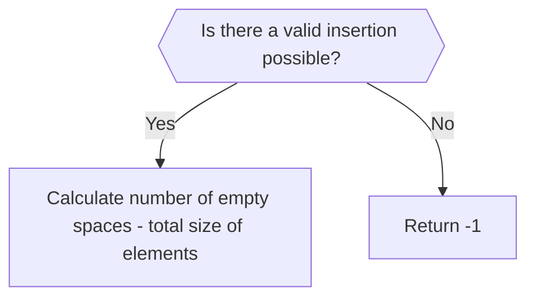

# cp v23.0.1 Editorial

## Table of Contents:


## Preface:

This is the official editorial for the _cp v23.0.1_ programming contest held by **GDSC Jadavpur University** on the 18th of November, 2023. A few pointers to note before reading the solutions-
- While the explanations are language agnostic, the code provided is in **C++**. While comments are present in the more tricky sections to help understand the implementation, if the solution is still not clear, feel free to reach out to the CP/DSA team leads or the Content team leads for further clarifications.
- Some problems need prerequisites to be known before trying to solve them. These prerequisites are mentioned as forewords to the solutions, along with links to resources from where they can be learnt. The reader is advised to view these resources.


## 1.  Welcome to GDSC

### Problem Statement:

"We are glad to announce that GDSC JU Chapter has officially kicked off with a bang and on such a special ocassion, Anurag, the GDSC Lead invited you to solve a special problem ;). You are given a string S of length N. You need to tell him whether the word "GDSC" is present in the string(i.e. if it possible to pick some characters from the string to form the word GDSC). Print YES or NO depending on the answer."

**Input Format**

- The first and only line of input contains a single string S. S contains all uppercase alphabets.

**Constraints**

- 1 <= |S| <= 100, where |S| denotes the length of the string S.

**Output Format**

- Output a single string, either YES or NO, depending on the answer. Note that the output is case-sensitive.

**Sample Input 0**

GGGDDDSSSCCCJJJUUU

**Sample Output 0**

YES

**Explanation 0**

```
For the given string, we can pick G,D,S,C once to form GDSC, so the answer is YES.
```

**Sample Input 1**

ETAICULTURE

**Sample Output 1**

NO

**Explanation 1**

```
In this string, G,D and S are not present, so the answer is NO.
```

**Sample Input 2**

CSDG

**Sample Output 2**

YES

--- 

### Solution:

```cpp
include <cmath>
#include <cstdio>
#include <vector>
#include <iostream>
#include <algorithm>
using namespace std;


int main() {
    /* Enter your code here. Read input from STDIN. Print output to STDOUT */  
    string in;
    cin >>in;
    vector<int> frequency(26,0); //for 26 letters
    int s = in.size();
    for(int  i = 0; i <s; i++) frequency[in[i] - 'A']++;

    
    // G, D , S and C occupy 2nd, 3rd, 6th and 18th indices
    if(frequency[6]>0 && frequency[3]>0 && frequency[18] > 0 && frequency[2] > 0 ) cout<<"YES"<<endl;
    else cout<<"NO"<<endl;
    
    return 0;
}

```

---
---

## 2. Goodies kitna loge discuss karle

### Problem Statement:

Anurag, the leader of GDSC, received a delightful surprise - a box of goodies from Google! However, there's a small hiccup; he received m goodies, but GDSC has n eager members. Anurag believes in equality and wishes to distribute the goodies evenly among his members.

Since he is very busy in his multiple internships, can you help him find the **minimum number of goodies** he must return to Google to ensure that every member receives the same amount of goodies?

**Input Format**

Input consists of two spaced integers **_m_** and **_n_**

1. Integer

- : representing the total number of goodies Anurag received.
- Integer

1. : representing the number of members in GDSC.

**Constraints**

**Output Format**

An integer representing the minimum number of goodies Anurag must return to Google.

**Sample Input 0**

7 3

**Sample Output 0**

1

**Explanation 0**

In the case of distributing 7 goodies among 3 members, Anurag can provide each member with 2 goodies, ensuring everyone gets an equal share. This means he has only 1 leftover goodie, which needs to be returned

**Sample Input 1**

17 5

**Sample Output 1**

2

---
### Solution:
```C++
#include <cmath>
#include <cstdio>
#include <vector>
#include <iostream>
#include <algorithm>
using namespace std;

int main() {
   int a,b;
    cin>>a>>b;
    // Returning the remainder after distribution (division)
    cout<<a%b;
    return 0;
}
```

---
---

## 3. Squarish Archery Target

### Problem Statement:

Meet Vikash, the Archery Champ and the quirkiest game inventor in town! Unlike others, Vikash isn't a fan of circles - they are just too "round" for his taste. So, he decided to create his own game with a twist - a squarish archery target of size

, with n (= N/2) layers. But here's the kicker: Vikash loves the oddness of odd numbers, so he decides to paint the target with two colours, with the **odd distant layers being red('X')** and **even distant layers being white(' ')**. In his odd, yet even, world, he rewards a "hit" if the arrow hits a red square; otherwise, it's a "miss".

Your task is to picture this: a square grid of dimensions

with alternating red and white layers around the center with the cells at a odd level marked as 'X' and those cells with even level from centre marked as ' ' (just an empty space).

And yes, Vikash's world is odd, so keep that in mind!

**Note** : The levels are measured from the centre of the Board

**Input Format**

The input consists of a single integer

representing the size of the archery target.

is of the form (where

is an odd no.).

**Constraints**

**Output Format**

Print an

grid where each cell contains '**X**' if it was a hit and **' '** if it was a miss.

**Sample Input 0**

6

**Sample Output 0**
```

XXXXXX
X    X
X XX X
X XX X
X    X
XXXXXX
```


**Explanation 0**

Here in this example for an 6 * 6 board (with 3 layers), the cells which were present at odd levels from centre i.e 1,3 were represented as 'X' and those rest cells presented at even levels from centre were marked as ' '

**Sample Input 1**

10

**Sample Output 1**
```
XXXXXXXXXX
X        X
X XXXXXX X
X X    X X
X X XX X X
X X XX X X
X X    X X
X XXXXXX X
X        X
XXXXXXXXXX
```

**Explanation 1**

In this example for the 10*10 board the cells which at odd levels from centre i.e 1,3,5 were represented as 'X' and those rest cells presented at even levels from centre were marked as ' '

---

### Solution:
###### Explanation:-

Let us take the case of N=6
Since we are creating a figure matrix, all we need is good algorithm to print "X" at the appropriate positional values (say i and j ) of the matrix.


We carry out an operation [1] to convert the x and y coordinates to a mirror series like 0,1,2,2,1,0. Now from the figure we can see that only those squares have "X" which are having minimum of X and Y values divisible by 2. Thus the code.

###### Code:-

```C++
#include <cmath>
#include <cstdio>
#include <vector>
#include <iostream>
#include <algorithm>
using namespace std;


int main() {
    /* Enter your code here. Read input from STDIN. Print output to STDOUT */   
    int N;
    cin>>N;
    for (int i = 0; i < N; i++) {
        for (int j = 0; j < N; j++){
            int x = (i >= N/2)?(N/2-1-i%(N/2)):i; //Operation [1]
            int y = (j >= N/2)?(N/2-1-j%(N/2)):j; //Operation [1]
            if (min(x,y)%2 == 0) cout<<"X";
            else cout<<" ";
        }
        cout<<"\n";
    }
}
```

---
---

## 4. Koto Sponsors Lagbe

### Problem Statement:

The events team of the GDSC JU chapter where discussing about a certain upcoming event. Generous prizes were planned for the event and as such, they needed some sponsors. And obviously, they asked the CP team to fas fas write a code that tells them the amount of sponsors they will require. But the CP team were busy preparing for this contest, so they are asking you to solve this question on their behalf.

Coming to the question, you have a quadratic equation (ax^2 + bx + c = 0), where the **value of b is unrestricted**, and you are given the value 'c'. The amount of sponsors required is the count of values of 'a' such that **1 <= a <= 1000**, and the quadratic equation has **equal roots**. Please help us find the amount of sponsors.

_Value of b is unrestricted implies b can take any possible value._

**Input Format**

- The first line of the input contains a positive integer T, denoting the number of testcases.
- T lines follow. The first and only line of every testcase contains a positive integer C, denoting the value of 'c' in the given quadratic equation.

**Constraints**

- 1 <= T <= 1000
- 1 <= C <= 1000
- Time limit - 1 second
- Memory limit - 256 MB

**Output Format**

- For every testcase, output in a new line, the amount of sponsors required.

**Sample Input 0**

1
10

**Sample Output 0**

10

**Explanation 0**

```
There are 10 possible values of a (namely 10, 40, 90, 160, 250, 360, 490, 640, 810, 1000), for which the given quadratic equation can have equal integral roots.
```

**Sample Input 1**

2
4
17

**Sample Output 1**

31
7

---

### Solution:

This question gives class 10 half yearly Maths exam vibes. It can be easily tackled with a little bit of algebra. The famous or infamous equation for solving roots of a quadratic equation :

$$ x = \frac{-b \pm \sqrt {b^2-4ac}}{2a} $$

Now the value of c is given and the value of a is restricted between 1 and 1000, so there can be only a few solutions for equation for which the roots are equal ,ie :

$$\implies b^2 = 4ac$$
$$\implies \boxed {a = b^2/4c}$$


# Solution

```cpp
#include <cmath>
#include <cstdio>
#include <vector>
#include <iostream>
#include <algorithm>
using namespace std;

void quadratic(int c){
    
    int sols = 0;
    for(int i = 1;; i++){
        long long rootsq = i*i;
        if((rootsq%(4*c) == 0) && (rootsq/(4*c) <= 1000)) sols++;
        if(rootsq/(4*c) > 1000) break;
    }
    cout<<sols<<endl;
}

int main() {
    /* Enter your code here. Read input from STDIN. Print output to STDOUT */   
    int x;
    cin >> x;
    for(int i = 0; i < x; i++){
        
        int c;
        cin >> c;
        quadratic(c);
        
    }
    return 0;
}

```

---
---

## 5. Too Much Storage

### Problem Statement:

Sid wants to download all the photos of the previous GDSC session to his computer, but is unsure whether he has enough space in his disk to download all of them.He has tasked you with finding out how much space he would have left after he downloads all the photos.

He has provided you with a bitmap of his disk in the form of a an array of binary strings, having 8 elements each, with 1 denoting occupied space and 0 denoting free space. Also provided is an array of binary strings, denoting the bitmaps of the various photos he wishes to download. Do note that **only one photo can be inserted into any given partition**. Return an integer that denotes the number of zeroes that would be left across all partitions once all the photos have been inserted. Return -1 in case it is not possible to insert any one of photos.

sample input: partitions:`{"10011000","11001111","11000011","10101111"}` and photos: `{"100","11","1"}`
output: 7 ``

Explanation: 
In every iteration, the zeroes being replaces is made **bold**, and the element of the array replacing it is written as its superscript.

Partition selected | Current string | element to be inserted | string after insertion
--- | ---| --- | ---
1 | 10011000 | 100 | 10011 ~~**000**~~ <sup>100</sup> 
2 | 11001111 | 11 |  11 ~~**00**~~ <sup>11</sup> 1111
3 | 11000011 | 1 | 1100 ~~**0**~~ <sup>1</sup> 011
4 | 10101111 | (None) | (No insertion)

Amount of empty space left = 2+0+3+2 = 7


**Note**: You can't consider zeroes from an element in the array as empty space, for example, after inserting the first element `100` into the first partition, we get 100111**00**-  the highlighted zeroes were inserted as part of the first photo, and thus cannot be considered free space and should not be counted.

---

### Solution:

This problem probably looks like it requires some complex string manipulation, with having to insert `1`'s and remove `0`'s. However, there are two key observations to be made here:

1. You've only been asked to **return the number of empty spaces, _not_ the partitions after insertions.** Thus, there is no real need to actually modify the strings, only some counting is needed.

2.  **You only need to count the empty spaces, not locate them.** Let me explain this point with an example:

- Say two of the  partitions are `10100000` `11001000`, and two of the elements to be inserted are `11` and `100`. Now, if you are **only** counting the number of empty spaces post-insertion, how does it matter if the insertion was optimal or not? No matter which empty space you insert the `11` and `100` in, the number of empty spaces left in these 2 partitions after would be `3`+`3`= `6`. 

So that's that- the number of empty spaces left does not actually take into consideration the optimal approach to inserting values. Therefore, our logic flowchart looks like this:



Now, we only need to find a way to determine if there is a valid way to insert all elements into partitions.
One simple way to do this is simply to **try to insert the smallest elements in the smallest values of the largest empty space in a partition** and keep doing so until we either

1. **Insert all elements**- a valid insertion is possible, we only need to count the empty spaces now.

2. **Find an element that cannot be inserted into any available partition**- no valid insertion is possible, we simply return -1.

The C++ code is commented with explanations and mnemonic code to aid the understanding. 


```cpp
#include <bits/stdc++.h>

using namespace std;

// a function to find the total empty space in a partition
// which is the total number of 0s in the string
int find_total_space(string s)
{
    int c = 0;
    for(int i = 0;i<s.size();i++)
    {
        if(s[i] == '0')
            c++;
    }
    return c;
}

// a function to find the largest empty space in a partition
//or the longest number of consecutive 0s in the string
int find_space(string s)
{
    int global_c = 0;
    for(int i = 0;i<s.size();i++)
    {
        int c = 0;
        if(s[i] == '0')
        {
            while(i<s.size() && s[i] == '0')
            {
                c++;i++;
            }
            if(c>global_c)
                global_c = c;
            i--;
        }
    }

    return global_c;
}

int FindStorage(vector<string> &partitions, vector<string> &photos)
{
	//edge case- we can't have more photos than partitions
    if(photos.size() > partitions.size())
        return -1;
    //vector is {consecutive free space in ith partition,total free space in ith partition}
    vector<pair<int,int>> free_space; 
    vector<int> photo_sizes;
    for(int i = 0;i<partitions.size();i++)
    {
	    //storing information about the free space in the partitions in the vector
        int c_size = find_space(partitions[i]);
        int t_size = find_total_space(partitions[i]);
        free_space.push_back({c_size,t_size});
    }

    for(int i = 0;i<photos.size();i++)
    {
	    //storing the size of the elements to be inserted in a vector
        photo_sizes.push_back(photos[i].size());
    }

	//sorting the paritions in order of most consecutive 0s available
    sort(free_space.begin(),free_space.end());
    //sorting the elements by their size
    sort(photo_sizes.begin(),photo_sizes.end());

    int sum = 0;
    //i is the iterator for the elements to be inserted
    //j is the iterator for the partitions
    int i,j;
    for(i = 0,j = 0;i<photo_sizes.size() && j<free_space.size();i++,j++)
    {
	    //if the current element is larger than the available free space
        if(free_space[j].first < photo_sizes[i])
        {
		    //we keep skipping partitions until we find one which can take the element 
            while(j < free_space.size() && free_space[j].first < photo_sizes[i])
            {
                j++;
            }
            //incase we run out of partitions, valid insertion is not possible
            if(j == free_space.size())
                return -1;
        }
    }

	//with the invalid cases taken care of, we only have valid cases left
	//we find amount of free space left here
	// amount of free space = number of empty spaces - total size of elements
   for(int i = 0;i<free_space.size();i++)
   {
        sum+=free_space[i].second;   
   }
    
   for(int i = 0;i<photo_sizes.size();i++)
   {
       sum-=photo_sizes[i];
   }
    
    return sum;

}

//main function to manage input/output
int main() 
{
     int t,l1,l2;
    cin >> t;
    cin >> l1 >> l2;
    vector<string> partitions(l1);
    vector<string> photos(l2);
    
    for(int i = 0;i<l1;i++)
    {
        cin >> partitions[i];
    }
    
    for(int i = 0;i<l2;i++)
    {
        cin >> photos[i];
    }
    
    int result = FindStorage(partitions,photos);
    cout << result << endl;
   


    
    return 0;
}
```

---
---

## 6. Swags where?

### Problem Statement:

Anupam and Vikash were discussing the swags distribution of an upcoming GDSC event. They decided to distribute N sets of stickers to the infinitely many participants taking part in the event. However, both of them had their own idea of distributing the stickers.

Anupam suggested that the sets should be distributed directly to every participant based on their ranks, i.e. the first rank gets A[1] stickers, the second rank gets A[2], … and the Nth rank gets A[N] stickers.

Vikash suggested that for every set that contains A[i] stickers, they would distribute 1 sticker each to every participant from 1 to A[i] ranks, i.e. if the first set contains 5 stickers, the first 5 ranks get a sticker and if the second set contains 2 stickers, only the first 2 ranks get a sticker.

To decide on one distribution, they decided to check which distribution of the two would lead to the lexicographically larger arrangement of sticker distribution. You, being a volunteer of the event, were asked to find the same. Print Anupam, Vikash or Equal for the respective cases.

A distribution x is lexicographically greater than a distribution y if in the first position where x and y differ, **xi>yi** or if **|x|>|y| and y is a prefix of x** (where |x| denotes the size of the distribution x).

**Input Format**

The first line of the input contains a postive integer N, denoting the number of sticker sets.

The second line of the input contains N space separated positive integers, denoting the amount of stickers in each set.

**Constraints**

- 1 <= N <= 10^5
- 1 <= A[i] <= 10^9
- Time limit - 1 second
- Memory limit - 256 MB

**Output Format**

Output a single string "Anupam", "Vikash" or "Equal" (without quotes), depending on the respective case. Note that the output is case-sensitive.

**Sample Input 0**
```

4
2 1 3 4
```

**Sample Output 0**

`Vikash`

**Explanation 0**
```
Distribution for Anupam is the same as the original stickers set: [2,1,3,4]

For Vikash, first 2 stickers are distributed to the first 2 ranks, current distribution : [1,1]
Next 1 sticker to the first rank, distribution becomes : [2,1]
Now 3 stickers to the first 3 ranks, distribution : [3,2,1]
And finally 4 stickers to the 4 ranks : [4,3,2,1]
Distribution for Vikash : [4,3,2,1]

As Vikash has the lexicographically larger distribution, we output "Vikash" (without quotes).
```

**Sample Input 1**
```

5
5 4 2 1 1
```

**Sample Output 1**

`Anupam`

**Explanation 1**
```
Distribution for Anupam : [5,4,2,1,1]
Distribution for Vikash : [5,3,2,2,1]
```

---
### Solution:

In order to find the lexicographic order between Anupam and Vikash's distributions, it seems prudent to first find out each of the distributions. We can then simply find the first point of difference (if any) between them to get the required answer.

> Anupam suggested that the sets should be distributed directly to every participant based on their ranks, i.e. the first rank gets A[1] stickers, the second rank gets A[2], … and the Nth rank gets A[N] stickers.

From the above statement given in the problem, it's clear that the input array itself forms Anupam's distribution.

> Vikash suggested that for every set that contains A[i] stickers, they would distribute 1 sticker each to every participant from 1 to A[i] ranks, i.e. if the first set contains 5 stickers, the first 5 ranks get a sticker and if the second set contains 2 stickers, only the first 2 ranks get a sticker.

Ok, so what can we infer from this?

Let's run through an example.
Sample input array `A`: `[2, 1, 3, 4]`

i | A[i] | Ranks receiving sticker | Vikash's distribution
--- | ---| --- | ---
0 | 2 | 1, 2 | [1, 1]
1 | 1 | 1 | [2, 1]
2 | 3 | 1, 2, 3 | [3, 2, 1]
3 | 4 | 1, 2, 3, 4 | [4, 3, 2, 1]

Final distribution of Vikash: `[4, 3, 2, 1]`

We can take away 2 things from here.
- The length of Vikash's distribution will be equal to the maximum value in `A` (let's call it `maxVal`). This is because only `maxVal` stickers make their way to the final participant. For all other values, the stickers get exhausted beforehand.
- The participant with rank 1, will have as many stickers as the number of values in `A` greater than or equal to 1. For rank `i`, we need to find the number of values in `A` greater than or equal to `i`.

This makes it very easy to generate Vikash's distribution. You can just run a linear search!
Roughly, here's what that would like like:

```cpp
vector<int> vikash;

// For each rank
for (int i = 0; i < maxVal; i++) {
	int count = 0;
	// Linear search through the input array
	for (int j = 0; j < arr.size(); j++) {
		if (arr[j] >= i + 1)
			count++;
	}
	vikash.push_back(count);
}
```

...*But* you'll hit TLE if you do that :P
The time complexity for this piece of code is $O(N^2)$, which isn't exactly great for the given constraints.

**Let us now optimise this!**
We basically need to find the number of elements that are greater than or equal to the rank of the participant. If you've had your binary search meal, you might feel that this is very similar to finding the *lower bound*.
If you sort the input array and then find the index of the lower bound of the participant's rank, you can use that to calculate the number of elements that are greater than or equal to that rank.

```cpp
int nStickers = sortedArr.end() - lower_bound(sortedArr.begin(), sortedArr.end(), RANK);
```

## Solution

```cpp
#include <cmath>
#include <cstdio>
#include <vector>
#include <iostream>
#include <algorithm>
using namespace std;

// Get the value at i-th index in Vikash's distribution
int vikash(vector<int> &sortedArr, int idx) {
	// Person with rank idx + 1 will receive stickers equal to the number of elements in sortedArr which is greater than idx + 1.
    return sortedArr.end() - lower_bound(sortedArr.begin(), sortedArr.end(), idx + 1);
}

int main() {
    int n;
    cin >> n;
    vector<int> arr;
    vector<int> anupam;
	int maxVal = 0;     // Store the size of Vikash's distribution

	// Input array
    for (int i = 0; i < n; i++) {
        int temp;
        cin >> temp;
        if (temp >= maxVal)
            maxVal = temp;
        arr.push_back(temp);
        anupam.push_back(temp);
    }

	sort(arr.begin(), arr.end());    // Sorting arr allows us to get the lower bound in O(log(N)) time

	// Compare lexicographic order
	// Find the first point of difference between both distributions
    for (int i = 0; i < min(n, maxVal); i++) {
		// Get the value at i-th index from Vikash's distribution
        int vikashVal = vikash(arr, i);

        if (anupam[i] > vikashVal) {
            cout << "Anupam";
            return 0;
        } else if (anupam[i] < vikashVal) {
            cout << "Vikash";
            return 0;
        }
    }

	// At this point, both distributions are similar upto min(n, maxVal) - 1 index
    if (n > maxVal)
        cout << "Anupam";
    else if (n < maxVal)
        cout << "Vikash";
    else
        cout << "Equal";

    return 0;
}
```

### Notes:

Notice how we also didn't create a `vector` for Vikash's distribution. Instead we utilised a function to find the value at a given index for what would have been Vikash's distribution. The reason for doing this was so our solution runs within the given memory constraints of the problem.


---
---

## 7. Google Dino

---
---

## 8. Alice goes Teaching 

### Problem Statement:

As we know, Alice has just started her job as a teacher in the Hackerrank School of Programming. Her class consists of infinitely many students (roll numbers starting from 1), of which N students are present on the first day, whose roll numbers are given in an array A. Now, Alice wants to take the attendance of all the students but as she is nervous, the principal Mr. P allowed her to take the attendance of as many students as she can. Mr. P also laid down some conditions that might (or might not) ease her job. The conditions are:

- If Alice starts marking the attendance from the roll number i, then she can only mark the attendance of roll i+2. If i+2 exists, she can then mark i+4 and then +6 and so on, else she has to stop her attendance marking count.
- Alice can add at most K students that are currently not present in the class and give them attendance (proxy ho gaya)

Being a dear friend of Alice, you decided to help her. Find the maximum number of students whose attendance you can mark.

**Input Format**

- The first line of input contains two positive integers N and K, denoting the size of the array A and the number of extra attendances that can be given.
- The second line contains N space-separated integers, denoting the array elements.

**Constraints**

- 1 <= N <=10^5
- 1 <= A[i] <= 10^9, A is sorted in strictly increasing order
- 0 <= K <= N
- Time limit - 1 second
- Memory limit - 256 MB

**Output Format**

- Output a single integer, the maximum attendance you can take.


---

> **Note:**
> This problem makes use of the [sliding window](https://www.geeksforgeeks.org/window-sliding-technique/?ref=header_search) algorithm. Readers are strongly encouraged to learn and practice some problems involving this algorithm before proceeding. [This Playlist](https://youtube.com/playlist?list=PL_z_8CaSLPWeM8BDJmIYDaoQ5zuwyxnfj&si=UEDeyyqBQvcIfBiY) is a good resource for getting to grips with problems making use of sliding windows.

## Solution:

The problem statement needs to be understood before we can begin trying to approach a solution. 

- According to the problem, if we start from the `i`<sup>th</sup> roll number, we can only mark the attendance of the `(i+2)`<sup>th</sup>  roll number if they are present. Similarly, if the `(i+2)`<sup>th</sup> is present, we can mark the attendance of the `(i+4)`<sup>th</sup> roll number is they are present, and so on. 

Now, what does this exactly mean? We can only mark roll numbers present if they form a **sequence of consecutive odd/even numbers**. Let this be explained with an example:

>  Say the roll numbers present are `1 2 3 4 6 8`. 
1. If we start marking from `1`, we can only mark `3` present. `2` will be skipped since it does not appear in our sequence of alternating odd numbers (yes, students who are among the `N` present might end up getting skipped).
2. Say we start marking from `2`. We can mark `4`,`6` and `8`. `3` will get skipped just as 2 was previously: it is not present in our sequence of alternating even numbers.


Right, so we established that we're dealing strictly with sequences of odd/even numbers. Lets analyse the next condition.

- Alice can mark at most `K` students who are not present in her class as present (referred to here as proxy)

This basically means that, in case there are some roll numbers missing from a sequence of consecutive odd/even numbers, we can essentially **fill in the gaps by marking absent people present at most `K` times.** Again, this is best understood with an example.

> Say the roll numbers are `1 2 3 4 6 12`, with `K` = 2.

1. `K` = 2 means that we can mark at most 2 absent students present in order to complete a sequence. 
2. We start counting from `2`. We mark `4` and `6` present, but then run into an issue- `8` and `10` are not present, and the sequence of even numbers resumes from `12`.
3. Well, since we have `K` = 2, we have the license to mark upto `2` absent students present to have a longer sequence of students. In this case, we can simply choose to fill in `8` and `10`, and then we get a sequence of `2 4 6 8 10 12`- a longer sequence than we could previously create.

Thus, what the question is asking us is basically **What is the longest sequence of alternating odd/even numbers you can create, if you can fill in upto K missing numbers in the middle.**

In case the problem statement is not clear, please try going through the above again- this might take a bit of time to click. Once we are done with understanding what the problem is, let us move on to trying to solve it.

According to our rephrased problem, we are finding a modified list of the longest sequence of alternating odd/even numbers. Since we strictly work either with only even numbers or only odd numbers, one simple thing we can do is **split the input array into two arrays of odd and even numbers**. We then find the longest sequence for both these arrays, and our final answers would be the maximum of those two.

Now, since we have two arrays and have separated the odd and even numbers, the we need to find the longest sequence of consecutive numbers in each list- this is where idea of using a **Sliding Window** arises. More specifically, our sliding window here will have of **variable length**.

What we do is slide the window over both arrays one at a time, find the longest sequence with atmost `K` gaps, return the size of the window for both cases, and display the maximum of the two. An example will make this clear.

> Say the roll numbers are `1 2 5 6 8 12 14 18` and `K` = 3.

The array of odd numbers (lets call it `odd`) is `1 5` and the array of even numbers (calling it `even`) is `2 6 8 12 14 18`.

1. Let's analyse the `odd` array first.

We start at `1`. The next number in the odd sequence would be `3`, but since that's missing, we decrease `K` by 1 (2 more skips are allowed). The number after 3 would be 5, which exists. Now, since 5 is the last number, we add the number of elements counted in the sequence upto now (here, three) and add the remaining `K` to this total (think about it- we can add 2 more elements after 5 before K gets exhausted). This results in a total of `5` for the even array.

2. Let's analyse the `even` array now.

We start at `2`. Now, the next element is 4- it's missing, decrement K. The next elements- 6 and 8 are present. 10 is again missing, so we decrement K again. 12 and 14 are present, but 16 is missing, so we decrement K again (K is now 0). After this, 18 is the last element present in the even array. On adding the number of elements counted and the remaining value of K, we get `9`.

Now, since the value from the even array is higher than the odd array, we pick the result obtained from the former.


Code:
```cpp
#include <bits/stdc++.h>
using namespace std;

int largest_window(vector<int> &v, int k)
{
    int i = 0,j = 0,n = v.size(),result = k, missed_slots = 0;
    while(j < n)
    {
        if(j > 0)
            missed_slots += (v[j] - v[j-1] -2)/2;
        // we exceeded k proxies, need to cut back K and move the sliding window forward
        while(missed_slots > k)
        {
            i++;
            missed_slots-= (v[i] - v[i-1] -2)/2;
        }
        // basically calculates max window size plus the k possible proxies we can attach
        result = max(result,k+j-i+1);
        j++;
    }
    return result;
}


int main() {
    int n,k;
    cin >> n >> k;
    vector <int> odd;
    vector <int> even;
    for(int i = 0;i<n;i++)
    {
        int x;
        cin >> x;
        if(x%2)
            odd.push_back(x);
        else
            even.push_back(x);
    }
    
    int result = max(largest_window(odd,k),largest_window(even,k));
    cout << result << endl;
    
    
    return 0;
}
```


